# **Detour4U by Code4U**

**Team:** Koo Ming Sheng, Lee Jia Quan, Au Yu Xuan, Siti Sarah Liyana binti Zaini

**Problem Statement:** Travel Planner (Lifestyle Track — Planning an Escape)

**Video Presentation:** https://youtu.be/yH2LVqF6ptE

**Presentation Slides:** https://drive.google.com/file/d/1jCpa28RILlOJcPSWnKOWNLEV4tsj3G-a/view?usp=sharing

**Prototype Link:** [Detour4U](https://code4-u.vercel.app/setup)

---

## **1. Project Overview**

### The Problem

Planning a group trip is not one problem, it is four problems that no single tool holds together: **budgeting, itinerary building, reconciling what everyone wants, and repairing the plan when reality breaks it.**

**The causes, as we understand them:**

1. **The work is asymmetric, but the tools assume it isn't.** In practice one person plans and everyone else replies "up to you" in the group chat. Collaboration features assume equal participation, so the forms go unfilled and the votes never reach quorum. The organiser ends up doing 90% of the work anyway — and then gets blamed for the restaurant nobody liked.
2. **Budget is treated as a spreadsheet, not a constraint.** Cost is something you tally afterwards, not something that shapes what gets suggested. So the plan and the money live in different tabs and drift apart.
3. **Every itinerary is static.** Tools model a trip as a finished list. But a flight is delayed, it rains for five hours, a temple closes for maintenance — and the plan silently becomes wrong with no help from the app that produced it.
4. **The work is scattered.** Flights in one app, stays in another, costs in a third, and the actual decisions in a WhatsApp thread nobody can search.

**Stakeholders:**

- **The Trip Captain** — the one friend who always ends up planning. Bears the workload and the blame. Our primary user.
- **The members** — 3–5 friends who genuinely do care but face a high participation cost: long forms, long documents, price comparisons. Their input is needed; their attention is scarce.

**Existing solutions and where they fall short:**

| Tool | What it does well | Where it falls short |
| :---- | :---- | :---- |
| **Wanderlog** | Collaborative itinerary building with maps and saved places | Assumes symmetric collaboration — in real groups only the organiser uses it. The itinerary is a static list: nothing helps when a flight slips or it rains. |
| **TripIt** | Consolidates confirmations into one timeline | Purely a record of decisions already made. No planning, no group preferences, no budget shaping, no recovery. |
| **Splitwise** | Cost splitting after the fact | Money is disconnected from the plan, so it can never prevent an over-budget itinerary — only report one. |

All three stop at the moment the plan is agreed. **None of them help after that moment**, which is exactly when a traveller is least able to help themselves.

### Our Solution

**Detour4U is a group travel planner built around a self-repairing itinerary.**

It accepts that group trips have one planner and several passengers, so it gives the Captain a cockpit and gives everyone else a 60-second, no-signup way to be heard. It turns budget, pace, dietary needs and must-dos into hard constraints that shape the plan rather than notes checked afterwards. And when the trip breaks — flight delayed, heavy rain, a venue closed, the budget trending over — it rebuilds the remaining plan in seconds and shows exactly what changed, what stayed, and why.

**Feature set**

- **Trip Setup** — destination, dates, group size, budget per person; produces an invite link and QR
- **Preference Intake** — a 60-second questionnaire per member: budget band, pace, interests, dietary needs, one must-do, one never-again. No account required
- **Taste Profile** — group consensus and, more importantly, the *conflicts*, surfaced for the Captain with a suggested resolution for each
- **Itinerary generation** — day-by-day blocks constrained by the group's real budget ceiling, pace and must-dos
- **Why this** — every block opens to show its justification: budget headroom, votes, which constraint it satisfies, and a cited source for the recommendation
- **Live budget bar** — spend against the group ceiling, always visible, recalculated on every change
- **Vote & Lock** — members thumb up or down; the Captain locks blocks, and a locked block is never moved or removed by any re-plan
- **Re-plan & Diff** — pick what happened, get a rebuilt plan in seconds as a reviewable diff (removed / moved / added / kept) with a budget delta. Accept all of it, or tick only the parts you want
- **Budget & Split** — per-person totals by category and a who-owes-who settlement

---

## **2. Ideation & Process**

### **2.1 Ideas We Considered**

| Idea | Why it was dropped / kept |
| :---- | :---- |
| **A (Chosen) — Self-repairing itinerary: a re-plan engine that rebuilds the remaining plan after a disruption** | **Kept.** This is the gap no competitor fills. Wanderlog, TripIt and Google Travel all end at "here is your plan"; none of them help at the airport. It is also the feature most visible in a 4-minute demo, and it forces the rest of the architecture (an itinerary must be a mutable, constrained object rather than a document) in a direction we wanted anyway. |
| **B (Chosen) — Captain cockpit with lightweight member input, instead of equal collaboration** | **Kept** after a deliberate pivot away from a democratic model (see below). Matches how group trips actually work, gives us a specific persona instead of "travellers", and makes the product demonstrable from one screen rather than needing four phones. |
| **C (Chosen) — RAG over local travel writing, so every recommendation carries a citation** | **Kept.** It is our answer to "why not just ask ChatGPT" — recommendations are local, specific and traceable to a source. It also became the evidence layer for the "Why this" panel, turning a technical choice into a product feature. |
| **D — Fully AI-driven autopilot: the AI plans, everyone follows** | **Dropped.** People do not hand a trip they paid for to a model, and it gave us no good answer to "what if it's wrong?". We kept AI autonomy only where speed genuinely beats deliberation — mid-trip re-planning, when one person is standing in an airport. |
| **E — Democratic consensus engine: the group votes, majority decides** | **Dropped after prototyping the idea on paper.** It deadlocks, it needs every member online, and any tie-break rule we invented was just "the organiser decides" in disguise. We kept the input and dropped the voting: **group input is required, group decision-making is not.** |
| **F — RAG over the group's own preferences and chat history** | **Dropped.** The data is around 2KB. A vector store would have added latency, a failure mode and no answer quality — using a heavy tool where a prompt would do. We redirected retrieval to unstructured local knowledge, where it earns its place. |
| **G — In-app group chat** | **Dropped.** The conversation already lives in WhatsApp and we cannot win it. Competing for it would cost us the features that actually differentiate us. |
| **H — Booking and payment inside the app** | **Dropped for scope.** Merchant integration, refunds and liability are a product in themselves. We link out to booking instead. |
| **I — Generic multi-city coverage from day one** | **Dropped for the prototype.** One city (Osaka) done properly — real cached place data, a real knowledge corpus — is more convincing than ten cities of thin generic output. Multi-city is a scaling question, not a feasibility one. |
| **J — Native mobile app (iOS/Android)** | **Dropped.** A responsive web app is permitted, reaches a reviewer's phone through a link with no install, and lets us spend our time on the re-plan engine instead of two build pipelines. |

### **2.2 Ideation Boards**

These are the cleaned-up versions of what we worked through — the branches we abandoned are kept in, because they are the part that shows the reasoning.

**Mindmap — our first session**

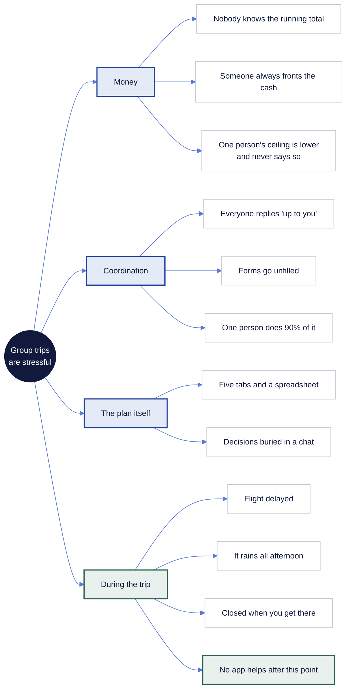

*Everything that makes group trips painful, before we knew which part we were solving. The "During the trip" branch is the one that survived — it was the only branch where no existing tool had anything to offer.*

**Problem tree — working back to root causes**

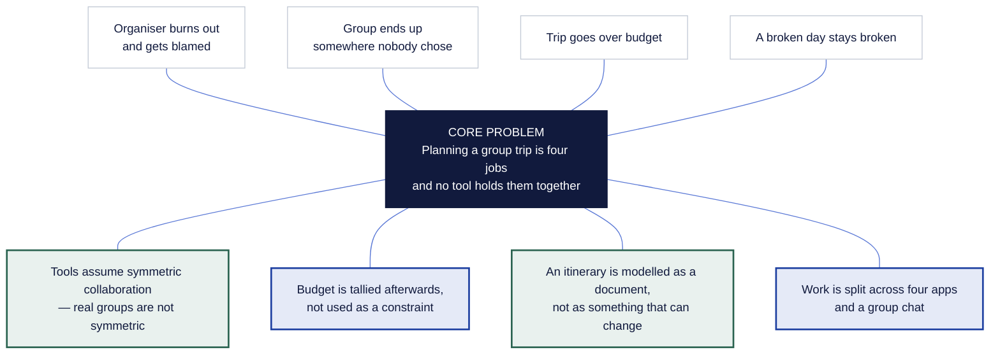

*Effects on top, root causes below. The two causes in green had no existing tooling at all — the asymmetric workload, and treating an itinerary as a fixed document. Those two became the product.*

**User flow — and the arrow that makes it a product**

```mermaid
%%{init: {'theme':'base','themeVariables':{'primaryColor':'#E5EAF7','primaryTextColor':'#111A3D','primaryBorderColor':'#1D3FA0','lineColor':'#5B79D6','secondaryColor':'#FFFFFF','tertiaryColor':'#F4F6FB','fontSize':'14px'}}}%%
flowchart LR
    S1["Trip Setup<br/>Captain · desktop"]
    S2["Preference Intake<br/>Members · phone · 60s"]
    S3["Taste Profile<br/>consensus + conflicts"]
    S4["Itinerary + Why this<br/>Captain decides"]
    S5["Vote & Lock<br/>plan committed"]
    S6["On the trip"]
    S7["Re-plan Diff<br/>phone · at the airport"]

    S1 --> S2 --> S3 --> S4 --> S5 --> S6
    S6 -- "flight delayed · rain ·<br/>closed · over budget" --> S7
    S7 -- "accept, whole or in part<br/>locked blocks never move" --> S4

    classDef box fill:#FFFFFF,stroke:#C3CAD6,color:#111A3D
    classDef hi fill:#E5EAF7,stroke:#1D3FA0,stroke-width:2px,color:#111A3D
    class S1,S2,S3,S5,S6 box
    class S4,S7 hi
```

*Every other travel app ends at "plan committed". The two blue boxes and the return arrow between them are the part nobody else has.*

**Idea evolution — including what we dropped**

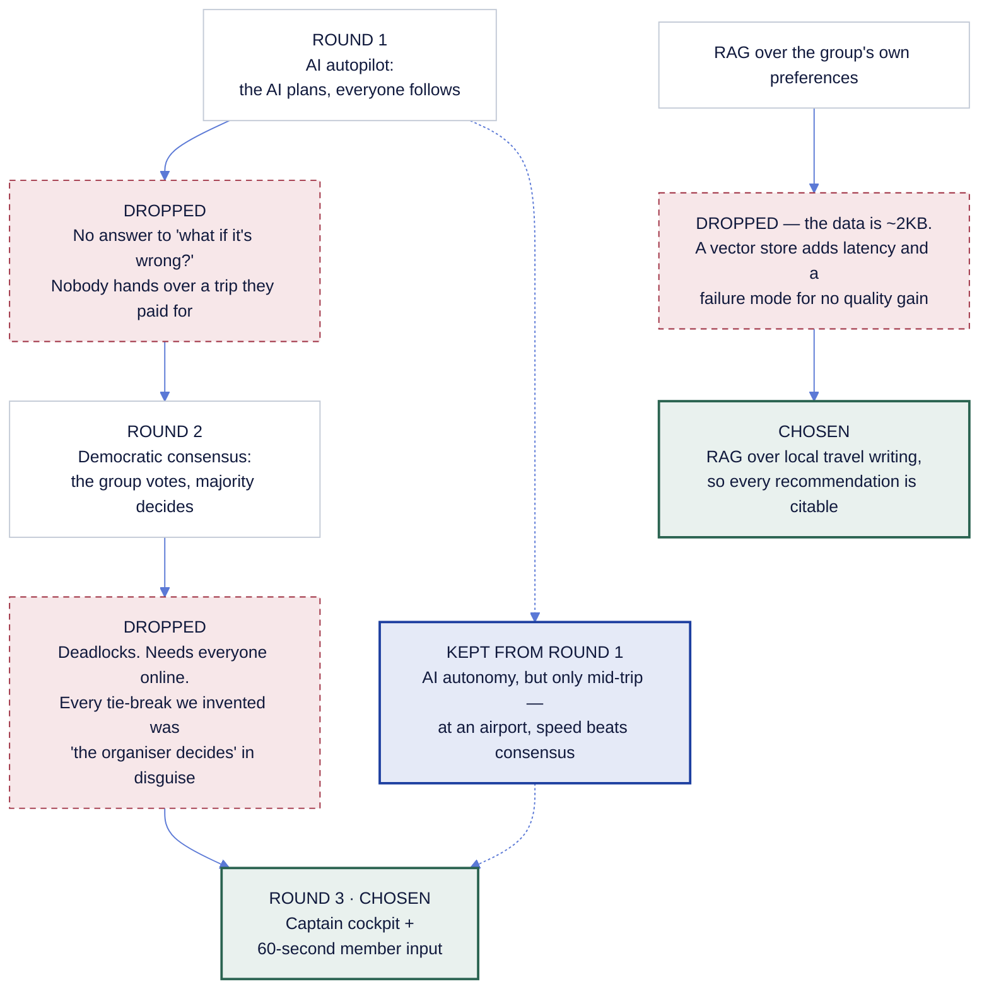

*Two full pivots. The middle one matters most: dropping majority voting is what produced our design principle — group input is required, group decision-making is not.*

### **2.3 Mentor Consultation**

| Date | Mentor | Feedback Received | What Was Changed |
| :---- | :---- | :---- | :---- |
| 11/09 | Mah Qing Fung | The video should show the *flow* rather than describe features — and have you considered making this a Progressive Web App? | Acted on both. The video is now structured as one continuous walkthrough of the demo script rather than a feature tour. The PWA suggestion changed our thinking more than we expected: the moment a traveller most needs a re-plan — delayed at a foreign airport, no roaming — is the moment they have the worst connectivity. Offline capability is on-thesis for this product, not a nice-to-have. We shipped an installable manifest for the prototype and made offline-first the first priority of the build phase (see §5). |
| 11/09 | Mah Qing Fung | Itinerary cards are too abstract — show a photo and an address like a real travel app. | Acted on. Blocks now carry an image and a street address: a thumbnail in the itinerary list, a full-width image and address in the block detail. It cost us very little and made the difference between a wireframe and something a user would trust. |
| 11/09 | Mah Qing Fung | "Swap" needs more detail — what actually happens when I press it? | Acted on. Swap now opens a panel of alternative candidates for that slot, each with its cost difference, which member's interests it matches, and a cited reason. This also surfaced something already true in our architecture but invisible in the UI: the model never invents a place, it picks from a filtered candidate set. Swap is that set, shown to the user. |
| 11/09 | Mah Qing Fung | When a re-plan adds a new place, explain what decided it. | Acted on. Every ADDED row in the diff now expands to show why that replacement was chosen: which constraint ruled out the original (closed, raining, over budget), the cost difference, whose interests it matches, and the source of the recommendation. Previously the reasoning existed in the engine but the user never saw it. |
| 11/09 | Mah Qing Fung | What happens to a place most of the group has voted against? There should be a backup. | Acted on, and it closed a real gap — voting was decorative until now. A block with a majority thumbs-down is flagged in the itinerary and offers the Captain alternatives. We deliberately built this on the same candidate panel as Swap: the underlying question ("what else could go in this slot, and why") is identical, so one mechanism serves both. |
| 11/09 | Mah Qing Fung | Let the user type what happened instead of only picking from preset cards. | Acted on for the prototype as a free-text field alongside the four preset triggers, with the typed text carried through to the diff. We were honest with the mentor that full natural-language parsing of an arbitrary disruption into a typed, constrained re-plan is a build-phase problem, not a two-day one — so the prototype shows the interaction and the build plan owns the parsing. |

---

## **3. Design & Prototype**

**UI Prototype:** [Detour4U](https://code4-u.vercel.app/setup) : [https://code4-u.vercel.app](https://code4-u.vercel.app/setup)

Our prototype is a deployed web app rather than a static mockup, so the flow can be clicked through end to end on both desktop and mobile. Screen sizes map to roles: **the Captain plans on a desktop cockpit; members and mid-trip re-planning happen on a phone.**

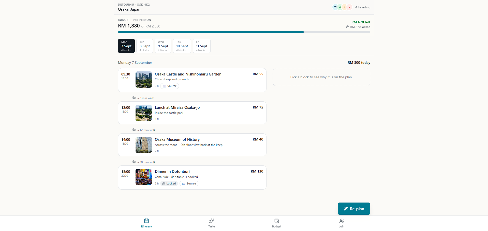

*Captain's cockpit. Two columns, because the Captain needs the plan, the running budget and a block's justification visible at once. The budget bar is pinned — cost is a constraint you are always looking at, not a total you find later.*

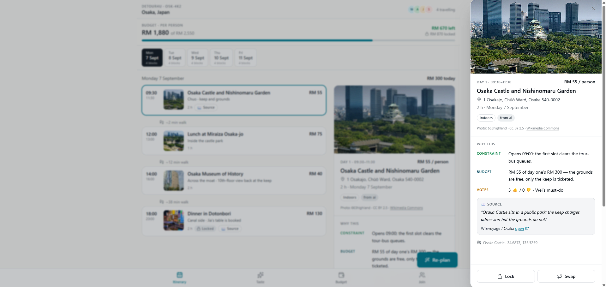

*Every block explains itself: budget headroom, votes, the constraint it satisfies, and a cited source. This exists to move the blame off the organiser and onto a visible, checkable rationale.*

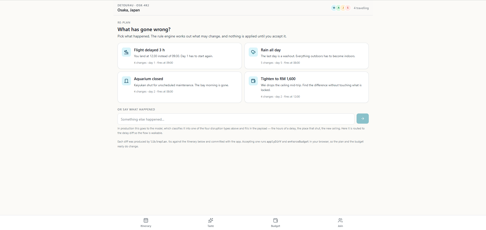

*"What happened?" Four disruption types. In production these fire from flight and weather APIs; in the prototype the Captain picks one.*

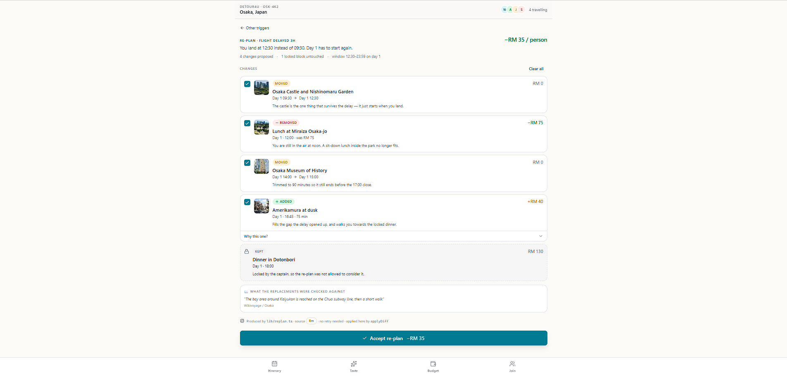

*The rebuilt day as a reviewable diff, with the budget delta at the top. Each row can be unticked — a re-plan is a proposal, not something done to you. Locked blocks appear under KEPT, untouched.*

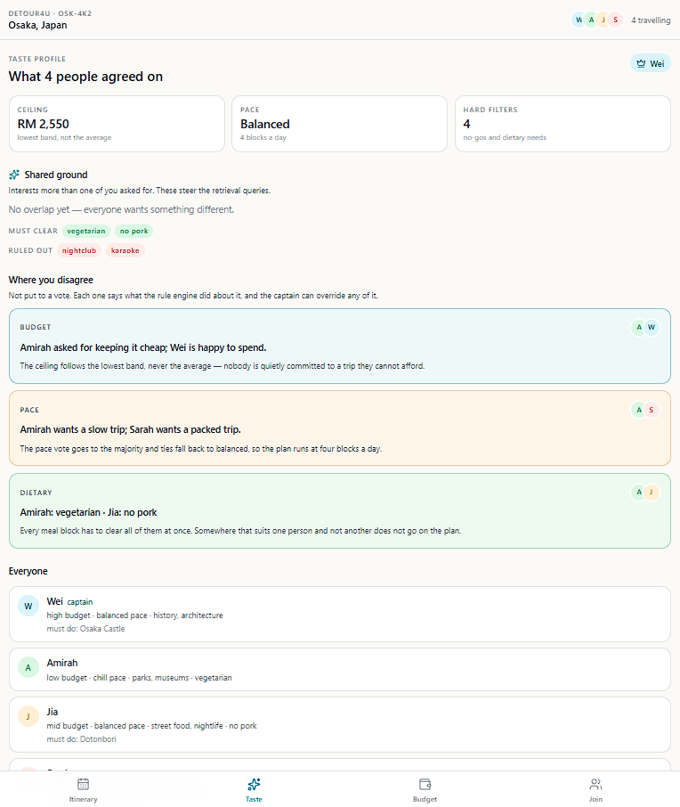

*Consensus, and more usefully the conflicts, each with a suggested resolution. When a fifth member joins, a new conflict card appears here — the group layer is doing work, not decoration.*

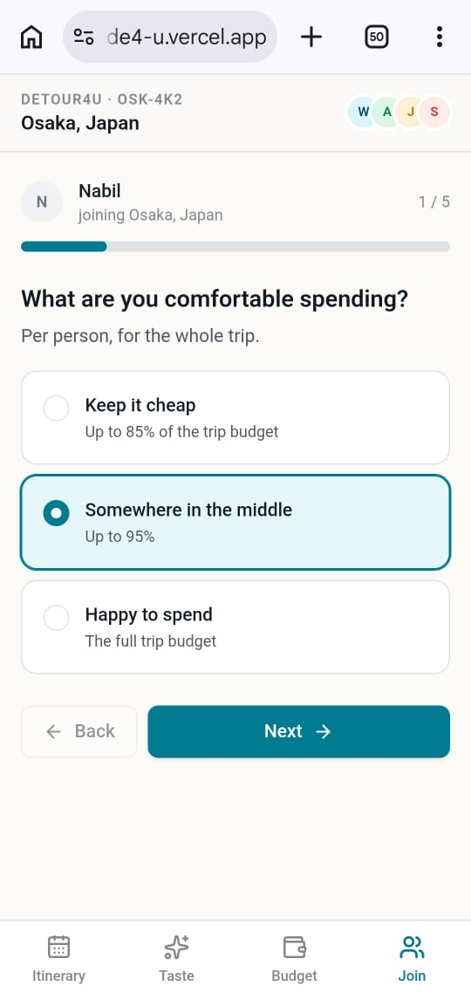

*The member's entire involvement: one question per screen, no account, finished in under a minute. Every design decision here is about lowering participation cost.*

---

## **4. What Makes It Different**

**1. The itinerary is a loop, not a line.**
Every comparable product ends at the moment the plan is agreed. Detour4U's re-plan takes a disruption, rebuilds only what is still ahead, and returns it as a diff you can partially accept. The original twist is treating an itinerary as a constrained, mutable object with fallbacks — not a document.

**2. It designs for the asymmetry instead of pretending it isn't there.**
> *Group trips don't have group planners. They have one planner and five passengers.*

Existing tools assume symmetric collaboration, which is why their collaboration features go unused. We give the Captain authority and the members a 60-second surface. Group input is required; group decision-making is not.

**3. Every block can explain itself — so the AI absorbs the blame.**
The organiser's hidden pain isn't effort, it's being blamed for choices. Opening a block shows budget headroom, votes, the constraint satisfied and a cited source. Responsibility moves from a person to a transparent, checkable rationale. We have not seen another travel product do this.

**4. Facts, taste, constraints and assembly are separated on purpose.**
External APIs supply facts (hours, price, address). Retrieval supplies taste (atmosphere, local tips, and the citation). A deterministic rule engine owns the hard constraints. The model only assembles. **Opening hours and prices never come from the model** — that is precisely the data a user checks and catches you on.

**5. Authority flips between planning and travelling.**
While planning, the AI drafts and the Captain commits. Once the trip starts, the AI decides and the Captain accepts with one tap — because at an airport, speed beats consensus. The same three roles, with the arrows reversed.

**6. Screen size follows role.**
Desktop is the Captain's cockpit. The phone is where members contribute and where re-planning happens. The form factor is part of the role design, not a responsive afterthought.

**7. Built for the moment the network is worst.**
The situation that most needs a re-plan — delayed at a foreign airport with no roaming — is also the situation with the least connectivity. So Detour4U is a Progressive Web App: installable to the home screen, with the itinerary, its fallbacks and the last computed plan available offline. A travel app that only works on good Wi-Fi has designed for the wrong moment.

| | Wanderlog | TripIt | Google Travel | **Detour4U** |
| :---- | :----: | :----: | :----: | :----: |
| Build an itinerary | ✅ | ❌ | ✅ | ✅ |
| Budget as a live constraint | ❌ | ❌ | ❌ | ✅ |
| Reconcile group preferences | Partial | ❌ | ❌ | ✅ |
| **Repair the plan after a disruption** | ❌ | ❌ | ❌ | ✅ |
| **Every choice carries a cited reason** | ❌ | ❌ | ❌ | ✅ |

---

## **5. Technical Architecture & Feasibility**

### Tech stack

| Layer | Choice | Why | Constraints we expect |
| :---- | :---- | :---- | :---- |
| **Frontend** | Next.js + TypeScript + Tailwind + shadcn/ui | One repo for UI and server code, so API keys stay server-side without a second service. shadcn gives us owned component source, which keeps the visual language consistent under time pressure. | App Router has a real learning curve; we keep server-side logic to thin route handlers to limit exposure to it. |
| **Hosting** | Vercel | Push-to-deploy, and a preview URL per pull request that we can hand to mentors and reviewers. Hobby functions allow up to 300s, so LLM latency is not a timeout risk. | Hobby tier bandwidth and build minutes are limited; fine at demo scale, would need a paid tier for real traffic. |
| **Database** | Supabase (Postgres) | Postgres, auth, realtime and pgvector in one free service instead of four. Realtime lets member preferences appear on the Captain's screen live. | Free projects pause after prolonged inactivity, so the project must be woken before any demo. Row-level security must be written by hand for link-based, account-less access. |
| **Vector search** | pgvector, inside Supabase | Zero additional infrastructure. Similarity search is a few lines of SQL — a dedicated vector database would be a service to deploy, monitor and pay for, for no quality gain at our corpus size. | ivfflat index quality depends on corpus size; at a few hundred chunks we accept approximate recall. |
| **LLM** | Gemini Flash, with structured output | A usable free tier and native `responseSchema` support, so the model's output shape is constrained rather than hoped for. We constrain candidate place IDs to an enum, so the model *structurally cannot* invent a location. | Free-tier rate limits are per-minute and per-day; we cache aggressively and ship a seed fallback so a rate-limit never breaks a demo. |
| **Offline / install** | PWA — web app manifest, then a service worker with a cached app shell and itinerary | The re-plan use case happens where connectivity is worst. A PWA is installable from a link with no app store, and lets a cached plan stay readable on a plane or abroad. | Offline *writes* need conflict resolution against Supabase when the device reconnects; the prototype ships the manifest and an installable shell, and the build phase owns sync. iOS PWA support lags Android for background features. |
| **Validation** | Zod | Model output is untrusted input. Zod validates it at runtime and gives us the TypeScript types for free via `z.infer`. | None material. |
| **Place facts** | Google Places, **pre-fetched into our own table** | Hours, price and coordinates must be correct, so they come from an API and never from the model. We fetch Osaka's candidate set once into Postgres rather than calling live. | Requires a billing account and has quotas — which is exactly why we cache. Cached data goes stale and would need a refresh job in production. |
| **Weather** | Open-Meteo | No API key and no billing account, which removes a whole class of demo-day failure. | Lower resolution than paid providers; adequate for an "is it raining in this window" trigger. |
| **Flights** | Amadeus Self-Service (test environment) | Free tier proves the integration path for live pricing and delay data. | Test-environment data is synthetic. For the prototype this demonstrates the seam, not real prices. |

### System architecture

Three sources run **in parallel** into an assembly step — this is not a four-layer stack.

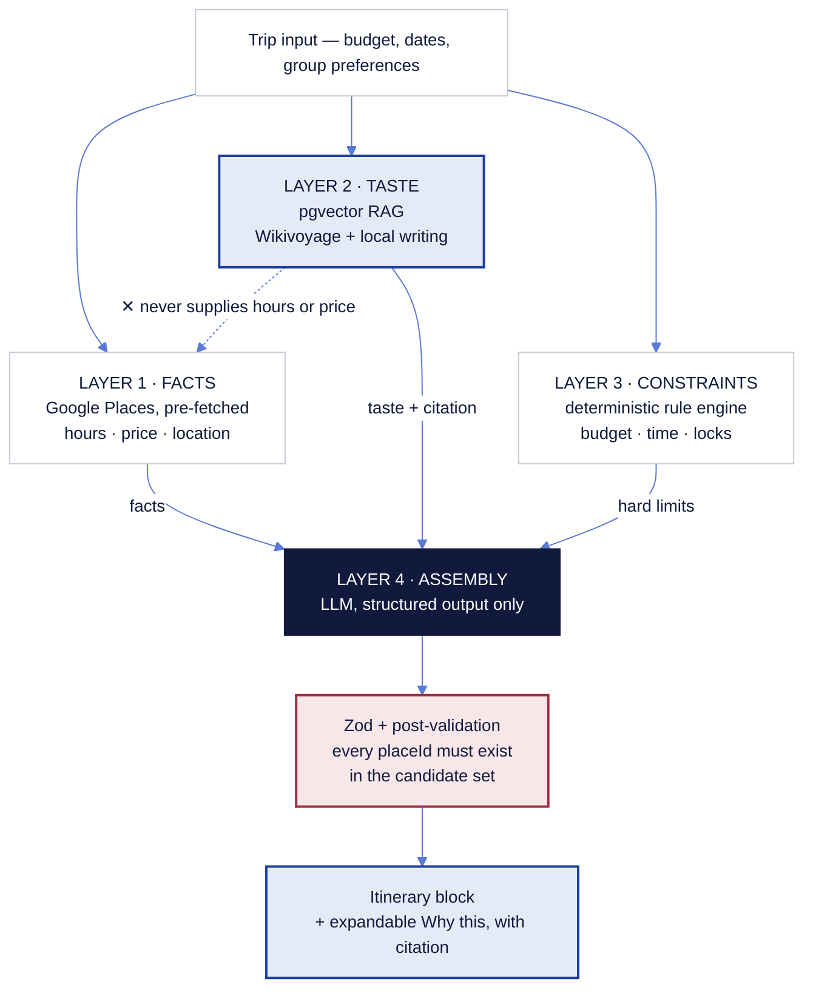

The dashed crossed edge is the most important rule in the diagram: **retrieval never supplies opening hours or prices.** Those are the facts a user checks, so they come from an API or not at all.

### What already exists

During the prototype phase we built and unit-tested the parts that carry the most risk, so that the build phase is integration rather than invention:

- **`lib/constraints.ts`** — the deterministic rule engine: budget ceiling from the group's *lowest* comfortable band capped by the trip budget, pace to blocks-per-day, dietary and must-do/never-again handling, time-overlap and opening-hours validation, and budget enforcement that only ever cuts unlocked blocks.
- **`lib/generate.ts`** — the generation pipeline with retry, post-validation, a fabricated-place drop threshold, and a seed fallback that refuses to substitute a mismatched city.
- **`lib/replan.ts`** — the re-plan engine, including the guarantee that any operation touching a locked or already-past block voids the entire batch.

The prototype's re-plan screen runs our real `applyDiff` and budget enforcement in the browser; the diffs it displays were produced by the engine offline and committed as fixtures.

### Build plan & scope — the 3-week build phase

**Week 1 — make the pipeline live.** Supabase schema and migrations; pre-fetch the Osaka place set; build the RAG index (300–800 chunks, one city) offline and commit it; replace the mock LLM with Gemini structured output behind the existing interface; wire the route handlers.

**Week 2 — make it a group product.** Link-based joining with no account; preference intake writing to Postgres; Taste Profile computed from real submissions; realtime so member input appears on the Captain's screen; voting and locking; budget and settlement.

**Week 3 — make it survive contact.** Live weather and flight-delay triggers; the full re-plan loop on real data; **the offline layer: service worker, cached itinerary and fallbacks, and read-only offline access to the current plan**; accessibility and responsive passes; error and empty states; deploy, and rehearse a demo that also works from seeded data with the network off.

Offline is sequenced into Week 3 rather than bolted on at the end because it is the mentor feedback we found most convincing: the product's defining moment happens where connectivity fails. Natural-language parsing of a free-text disruption into a typed, constrained re-plan is also Week 3 work — the prototype demonstrates the interaction, the build phase makes it real.

**Explicitly out of scope for the build phase**, so that what we do build is finished:

- Booking and payment — we link out
- In-app chat — the group already has WhatsApp
- Full account systems — link-based access only
- Cities other than Osaka — the corpus and cached place data are per-city by design, so this is a data task, not an architectural one
- Native mobile applications — responsive web only

We would rather demonstrate one city working end to end, including the failure paths, than ten cities that only work when nothing goes wrong.
