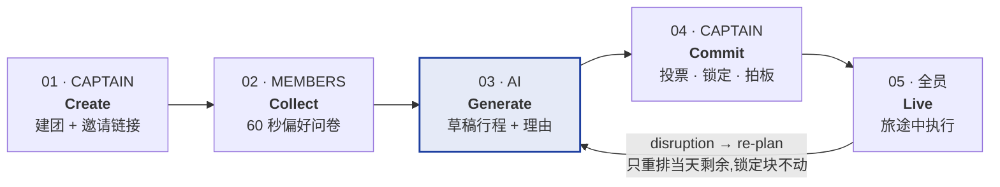

# Detour — Product Design Doc

**Version** v1 · Sep 3, 2026
**Hackathon** Aug 31 – Sep 13 · Lifestyle Track — "Planning an Escape"
**Platform** Web (responsive) · Next.js + Vercel
**App language** English (界面文案全英文)
**Demo city** Osaka · 4 人 5 天 · RM3000 / 人

> Detour 是一个**会自己修复的行程规划工具**。它承认团体旅行只有一个真正的策划人,把群体偏好变成他手上的弹药;并且在计划被现实打乱时,三秒内重排当天剩余行程,还告诉你改了什么、为什么。

---

## 1. 目标用户

不是「travellers」。是**东南亚 3–6 人的朋友团**,4–7 天预算游,人均 RM2k–4k。
团里有两种人,他们的产品需求完全不同。

| 角色 | 是谁 | 他的真实痛点 | 我们给他什么 |
|---|---|---|---|
| **Trip Captain**<br>主用户 · 1 人 | 那个每次都被推去规划的朋友。开了五个 tab、一个 Excel、一个群组 | 累,而且**被怪**——「谁选的这家餐厅」「行程太赶了吧」 | 一个驾驶舱 + 每个决定都有可展开的透明理由 |
| **Member**<br>次要 · 2–5 人 | 在群里回「都可以」「你决定啦」的人 | 不是不在乎,是**参与成本太高**——填表、比价、看长文档 | 60 秒问卷 + 👍👎,免注册,链接直接进 |

---

## 2. 四条设计原则

遇到功能争论时回来看这四条。

### 原则 1 — 群体输入是必需的,群体决策不是

收集所有人的偏好和投票,但不做全民表决。投票是给 Captain 的弹药,拍板权在他手上。

### 原则 2 — 规划期 AI 起草,旅途中 AI 决策

规划期 AI 永不自动提交,Captain 拍板;一旦上路,人在机场没空开会,AI 直接给方案,Captain 只按一下接受。

### 原则 3 — 每个行程块都要能解释自己

点开任何一个块,都能看到:预算依据、谁投了票、命中了谁的必去项、推荐出自哪里。责任从人转移到透明的理由上。

### 原则 4 — 事实永远不来自模型

营业时间、价格、地址、班次一律走 API。模型只负责组装和文案,规则引擎负责硬约束。用户会当场翻脸的数据,不交给会幻觉的东西。

---

## 3. 产品生命周期:一个循环,不是一条直线

市面上所有旅行 app 都在 `COMMIT` 那里结束——你拿到一张行程表,然后就没有然后了。
**Detour 的价值全部在那条回头的箭头上。**



```
  ┌─────────── 现有旅行 app 到这里就结束了 ───────────┐
  Create  →  Collect  →  Generate  →  Commit         Live
                            ▲                          │
                            └──────────────────────────┘
                        disruption → re-plan(只重排当天剩余)
```

意外发生时**不是重新规划整趟旅程**,而是只重排**当天剩余**的部分,已锁定的块原地不动,并且**连预算一起重算**。

---

## 4. 主要功能

`P0` = 原型必须有 · `P1` = 有时间才做 · `P2` = 只在架构图和 pitch 里出现,不实作

| 阶段 | 功能 | 做什么 | 优先级 |
|---|---|---|---|
| Create | `Trip Setup` | 目的地、日期、人均预算、人数 → 生成邀请链接 / QR | **P0** |
| Collect | `Preference Intake` | 60 秒问卷:预算带、节奏(chill/packed)、兴趣标签、饮食限制、必去、绝不去、可用日期。免注册 | **P0** |
| Collect | `Taste Profile` | 群体共识视图:重叠兴趣、冲突高亮(「3 人要 chill,1 人要 packed」「1 人吃素」) | **P0** |
| Generate | `Itinerary Draft` | 按天生成行程块(时间/花费/地点),受预算 + 节奏 + 全员必去项约束 | **P0** |
| Generate | `Why This` | 每个块可展开:预算依据、投票数、命中谁的必去、📖 引用出处(RAG) | **P0** |
| Commit | `Vote & Lock` | 成员 👍👎;Captain 锁定块——锁定后 re-plan 绝不移动它 | **P0** |
| Commit | `Live Budget Bar` | 人均花费 vs 团队预算,超支变红并建议可降级的块 | **P0** |
| Live | `Re-plan & Diff` | 选触发情境 → 3 秒重排当天剩余 → diff 显示删/挪/加 + 预算变化 → 一键接受 | **P0** |
| Commit | `Split & Settle` | who-owes-who 分账结算 | P1 |
| Generate | `Map Day View` | 当天地图视图,含点与点之间步行时间 | P1 |
| Create | `Solo Mode` | 无群体层,AI 全权规划 | P1 |
| Live | `Auto Triggers` | 真实航班 webhook / 天气自动触发 re-plan(v1 手动模拟) | P2 |
| Live | `Receipt Split` | 收据拍照 → 自动分账 | P2 |

---

## 5. 核心界面(七张,构成完整 demo 路径)

Design 那 10% 里的 "Mockup Completeness" 要求 *covers the core flow end-to-end*。这七张画完就满分。
**界面文案全部英文。**

| # | Screen | 必须出现的东西 |
|---|---|---|
| 01 | `Trip Setup` | 目的地 / 日期 / 人均预算输入,底部大按钮 `Create trip`,成功后弹出 invite link + QR |
| 02 | `Preference Intake` | 成员视角。分步问卷,每屏一题,进度条,最后一屏 `Done — 47 seconds` |
| 03 | `Taste Profile` | 群体共识可视化:共同兴趣标签 + 冲突卡片(带头像),Captain 视角 |
| 04 | `Itinerary` | 日期 tab,行程块列表(时间/名称/人均花费/步行时间),**顶部固定预算条**,右上角 `Re-plan` |
| 05 | `Block Detail` | 「Why this」卡:BUDGET / VOTES / CONSTRAINT / 📖 SOURCE 四行 + `Lock` `Swap` |
| 06 | `Re-plan Diff` | 触发情境选择器 → diff 视图:REMOVED / MOVED / ADDED / KEPT,顶部显示 `−RM 18 / person` |
| 07 | `Budget & Split` | 人均总花费、分类占比、who-owes-who 列表 |

### Demo 脚本(4 分钟)

`01` → `02`(切换到手机视角演示成员填问卷)→ `03` → `04` → `05`(点开看引用出处)→ **`06` 现场按下 Re-plan** → `07`

第 6 步停留最久。

### 界面文案参考(全英文)

**Block Detail — Why this**

```
DAY 2 · 19:30                                    RM 42 / person
Sennichimae Arcade · Backstreet Kushikatsu
Namba · 6 min walk · ~90 min

WHY THIS
[BUDGET]      Fits inside today's RM 980 remaining — reserve untouched
[VOTES]       3 👍 / 0 👎 · matches Wei's must-do "local, not touristy"
[CONSTRAINT]  Amirah is vegetarian → venue has vegetarian options
[📖 SOURCE]   Wikivoyage / Osaka: "Most visitors stop at Dotonbori;
              the arcades two streets south fill with locals after 7pm."

              [ Lock ]  [ Swap ]
```

**Re-plan Diff**

```
RE-PLAN · FLIGHT DELAYED 3H                    −RM 18 / person
Day 1 afternoon rebuilt
4 blocks affected · 2 locked blocks untouched

CHANGES
[REMOVED]  14:00 Osaka Castle keep — last entry passes before you land
[MOVED]    18:00 → 20:30 Dotonbori dinner (open until 23:00, confirmed)
[ADDED]    21:30 Karahori arcade night walk — fills the gap after the delay
[KEPT]     🔒 Day 1 hotel check-in · 🔒 Jia's must-do café (moved to Day 2)

           [ Accept re-plan ]  [ Accept some ]
```

---

## 6. 数据模型草图

够用就好,不做完整 schema。重点是 `Block` 上那几个字段——它们是「能自己解释自己」和「re-plan 不动锁定块」这两个特性的实现基础。

| 实体 | 关键字段 |
|---|---|
| `Trip` | destination · start_date · end_date · budget_per_person · captain_id |
| `Member` | trip_id · display_name · joined_via_link(无密码) |
| `Preference` | member_id · budget_band · pace · interests[] · dietary[] · must_do[] · no_go[] · available_dates |
| `Block` | trip_id · day · start_time · duration · title · place_id · cost_per_person · **locked** · **reason{}** · **source_citation** |
| `Vote` | member_id · block_id · value(+1 / −1) |
| `Disruption` | trip_id · type(delay / weather / closed / overbudget)· day · triggered_at |
| `ReplanDiff` | disruption_id · removed[] · moved[] · added[] · kept[] · budget_delta |
| `Expense` | trip_id · payer_id · amount · split_among[] |

> **设计决定:** `ReplanDiff` 单独存一张表,而不是直接改 `Block`——这样 diff 才有历史、才能「只接受部分」、才能回滚。这是 re-plan 功能的关键。

---

## 7. 技术架构:四层

> **API 管事实 / RAG 管品味 / 规则管约束 / LLM 管组装**

三个来源**并行**汇入组装层,不是串行堆叠。

| 层 | 负责 | 用什么 |
|---|---|---|
| 1 · Facts | 营业时间 · 价格 · 地址 · 交通时间 | Google Places / Amadeus API |
| 2 · Taste | 氛围 · 在地建议 · 避雷 · **出处** | RAG · pgvector · Wikivoyage + Reddit(单城市) |
| 3 · Constraints | 预算上限 · 时间窗 · 锁定项 · 步行距离 | 确定性规则引擎 |
| 4 · Assembly | 排成一天的行程 | LLM structured output |

**❌ RAG 绝不提供 hours / price。** 那正是用户会当场翻脸的数据,幻觉成本最高。

### RAG 的边界

- ❌ **别做** — 把用户偏好 / 群组资料丢进 vector DB。这些数据约 2KB,直接塞 prompt。加向量库只带来延迟和失败点。
- ✅ **要做** — 检索非结构化的**在地知识**:攻略、游记、Reddit 讨论。它回答了「这跟 ChatGPT 有什么差别」。
- 只做**一个城市**(大阪),300–800 chunk,**离线建索引 commit 进 repo,现场绝不跑爬虫**。
- 用 Supabase 内建的 **pgvector**,零新增基建。别上 Pinecone / Weaviate。

### 技术栈

| 层 | 选型 |
|---|---|
| 前端 / 部署 | Next.js + Tailwind + Vercel |
| 后端 / 数据 | Supabase(auth + Postgres + realtime) |
| 向量检索 | pgvector(Supabase 内建) |
| 事实数据 | Google Places / Amadeus free tier |
| 触发器 | OpenWeather + 手动模拟 |
| 生成 | LLM structured output + 确定性约束层 |

---

## 8. 明确不做

主动讲出砍了什么、为什么砍,比假装什么都做得完更容易拿分。

- ❌ **真实下单 / 支付** — 只做 booking 深链
- ❌ **聊天室** — 群聊已经在 WhatsApp 里了,不抢
- ❌ **完整账号体系** — magic link 就够
- ❌ **真实航班 webhook** — v1 手动模拟触发,架构图里画出真实接法
- ❌ **评论 / 社交 / UGC**
- ❌ **多城市 RAG 语料** — 只做大阪一个城市

---

## 9. 原型验收标准 · Sep 13

到评审那天,以下六条全部为真,才算做完。任何新功能想加进来,先问它会不会威胁这六条。

- [ ] 一条 demo 路径能从 `Trip Setup` 一路走到 `Re-plan Diff`,中间不中断、不报错
- [ ] 七张核心界面全部有可点击 mockup,文案全英文,手机浏览器能开
- [ ] 至少一个行程块点开后能看到**真实的 RAG 引用出处**,不是写死的假文字
- [ ] Re-plan 三秒内出 diff,**锁定块确实没动**,预算数字跟着变
- [ ] 部署在公开 URL 上(Vercel),评审用自己的手机能打开
- [ ] Seed trip 已预置好,断网也能演示;另有一段录好的 demo 影片当备份

---

## 10. 评审必问的三个问题

**Q — 这跟我直接问 ChatGPT 有什么差别?**
A — ChatGPT 给你一段文字,我们给你一个**带约束、带出处、能重排的行程对象**。四层架构:API 管事实所以不会记错营业时间,RAG 管品味所以推荐是在地的而且能点开看引用,规则引擎管预算和锁定所以它不会给你排一个超支的行程。

**Q — AI 排错了怎么办?**
A — 三道防线:硬约束由**确定性规则引擎**把关,不交给模型;事实数据走 API 不走模型;最后 Captain 有完整 override 权和锁定机制。AI 在规划期**永不自动提交**。

**Q — 大家意见不合怎么办?**
A — 我们的立场是:**群体输入是必需的,群体决策不是。** 真实的团体旅行本来就有一个 Captain,我们不假装它是民主制。投票和偏好是给 Captain 的弹药和挡枪牌,拍板权在他手上,而每个决定都有可展开的透明理由。

---

*配套文件:Detour Prototype Plan(评分策略 · 角色分工 · 四层架构图 · Aug 31 – Sep 13 时间线)*
